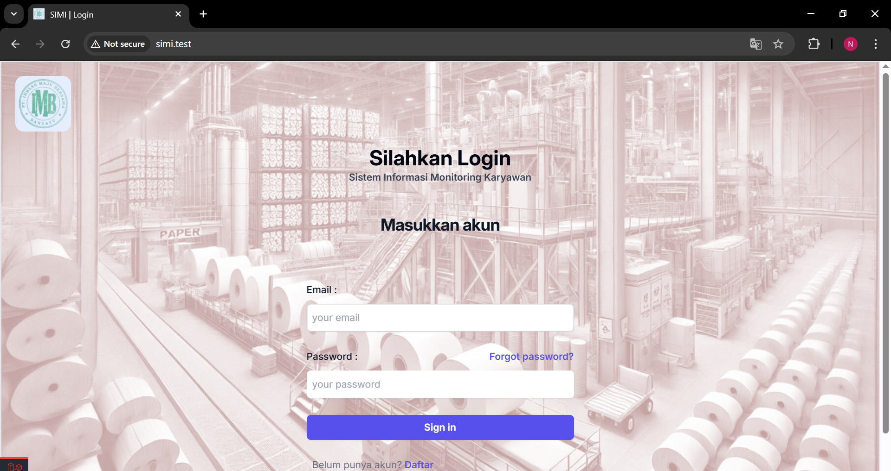
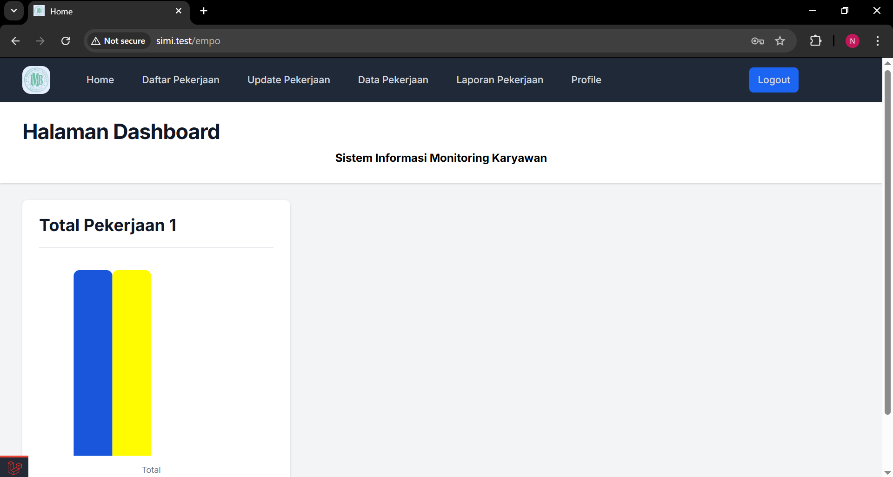
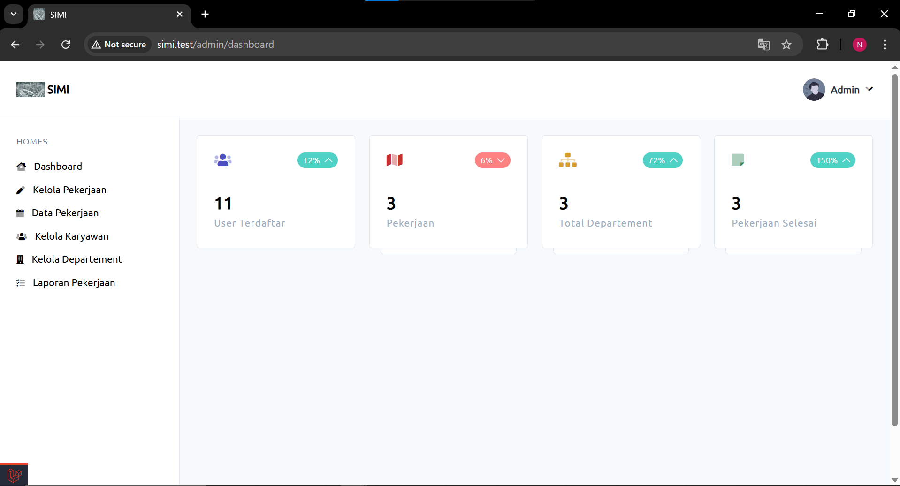
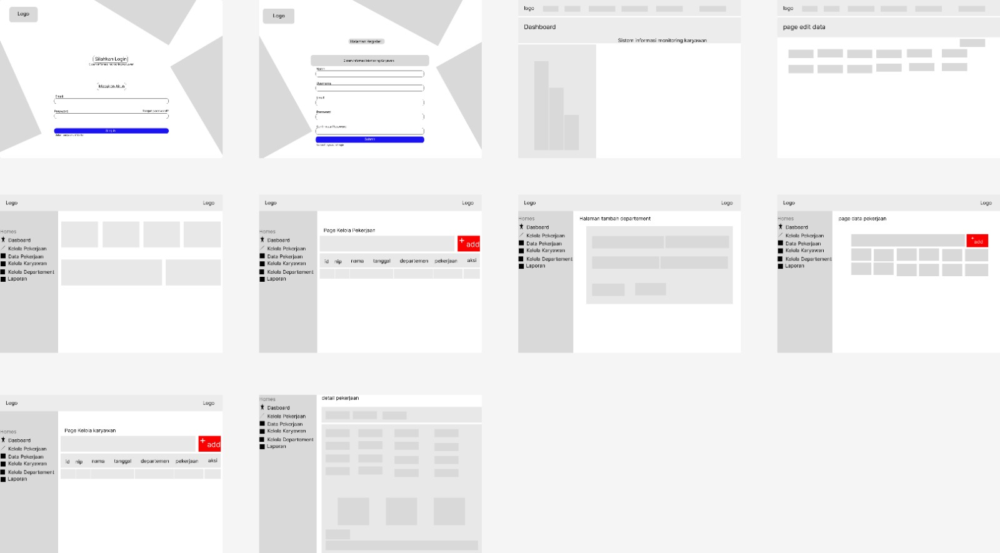
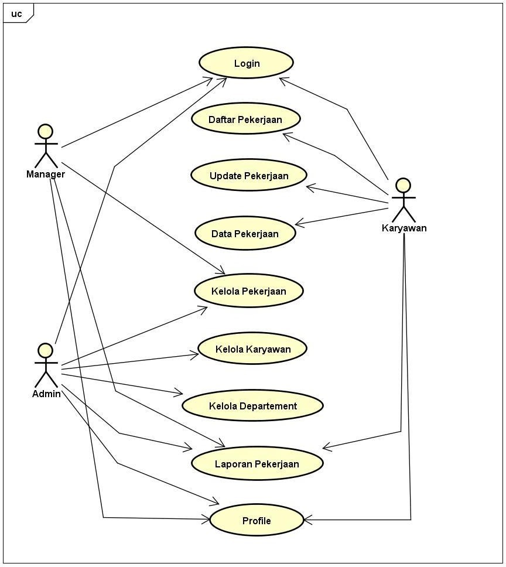
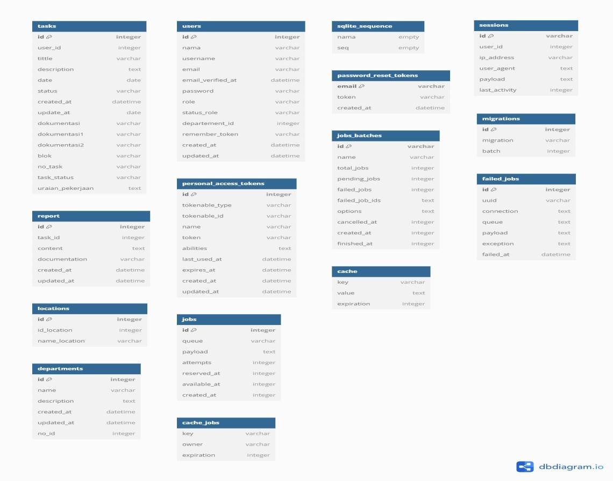

# Aplikasi Sistem Informasi Monitoring Karyawan (SIMI)

_Aplikasi berbasis Website Sistem Informasi Monitoring Karyawan, fungsionalitas dari aplikasi tersebut untuk memonitoring pekerjaan karyawan dan mengefesiensikan sebuah perusahaan agar mencapai tujuan yang ada serta dapat mengatur pekerjaan yang dilakukan oleh karyawan_

## Fitur

1.  **Manager**
    -   **Dashboard**
        > Dashboard manager yang menampilkan :
        >
        > -   Data karyawan
        > -   Total pekerjaan
        > -   Departement perusahaan
        > -   Pekerjaan selesai
        > -   Pekerjaan progress
        > -   Pekerjaan Pending
    -   **Kelola Karyawan**
        > Menampilkan data karyawan yang diantaranya seperti :
        >
        > -   ID Karyawan
        > -   Nama
        > -   Username
        > -   Email
        > -   Departement
    -   **Kelola Departement**
        > Menampilkan data Departement yang diantaranya seperti :
        >
        > -   ID Departement
        > -   No Departement
        > -   Nama Departement
        > -   Description
        >     > Deskripsi pekerjaan dari departement tersebut
    -   **Laporan Pekerjaan**
        > Menampilkan data dari laporan pekerjaan yang diantaranya seperti :
        >
        > -   Nomor Pekerjaan
        > -   User ID
        > -   Nama
        > -   Pekerjaan
        > -   Lokasi
        > -   Blok
        > -   Tanggal
        >     > Laporan pekerjaan dapat ditentukan oleh range tanggal
2.  **Admin**

    -   **Dashboard**
        > Dashboard admin yang ditampilkan :
        >
        > -   User terdaftar
        > -   Total Pekerjaan
        > -   Total Departement
        > -   Pekerjaan Selesai
    -   **Kelola Pekerjaan**

        > Kelola Pekerjaan merupakan sistem CRUD untuk mengelola pekerjaan :
        >
        > -   **Add / Tambah Pekerjaan**
        >     > Form add/tambah pekerjaan yang berisi seperti :
        >     >
        >     > -   Nomor pekerjaan : default sudah ada untuk membuat unique setiap nomor pekerjaan
        >     > -   Tanggal penyelesaian
        >     > -   Nama pekerja
        >     > -   Description ->Deskripsi pekerjaan.
        >     > -   Blok -> Blok area.
        >     > -   Penyelesaian -> Date.
        >     > -   Title -> Judul pekerjaan.
        >     > -   Lokasi -> Lokasi Pekerjaan.
        >     > -   Dokumentasi -> JPG.
        > -   **Edit Pekerjaan**
        >     > Form edit pekerjaan yang dapat diedit sebagai berikut :
        >     >
        >     > -   Penyelesaian.
        >     > -   Nama pekerja.
        >     > -   Status pekerjaan.
        >     > -   Title.
        >     > -   Lokasi.
        >     > -   Blok.
        >     > -   Dokumentasi.
        > -   **View Pekerjaan**
        >     > Menampilkan detail data pekerjaan
        >     >
        >     > -   Nomor Pekerjaan.
        >     > -   Nama pekerja.
        >     > -   Tanggal Penyelesaian.
        >     > -   Deskripsi pekerjaan.
        >     > -   Blok.
        >     > -   Title.
        >     > -   Lokasi.
        >     > -   Dokumentasi.
        > -   **Hapus data pekerjaan**

    -   **Kelola karyawan**
        > Kelola karyawan merupakan sebuah CRUD dalam mengelola karyawan :
        >
        > -   **Add / Tambah Karyawan**
        >     > Menambahkan sebuah data karayawan yang berisi form sebagai berikut :
        >     >
        >     > -   Nama.
        >     > -   Username.
        >     > -   Email.
        >     > -   Role.
        >     > -   Departement.
        >     > -   Password .
        >     > -   Konfiramsi Password .
        > -   **Edit**
        >     > Mengedit data karyawan seperti :
        >     >
        >     > -   Nama
        >     > -   Username
        >     > -   Email
        >     > -   Role
        >     > -   Departement
        >     > -   Password
        > -   **View**
        >     > Menampilkan data karyawan seperti :
        >     >
        >     > -   Nama
        >     > -   Username
        >     > -   Email
        >     > -   Role
        >     > -   Departement
        >     > -   Password
        > -   **Hapus data karyawan**
    -   **Kelola Departement**
        > Kelola Departement menggunakan sitem CRUD seperti berikut :
        >
        > -   **Add Departement**
        >     > -   ID
        >     > -   Nomor ID
        >     > -   Nama
        >     > -   Deskripsi
        > -   **Edit Departement**
        >     > -   ID
        >     > -   Nomor ID
        >     > -   Nama
        >     > -   Deskripsi
        > -   **Hapus Departement**
    -   **Laporan Pekerjaan**
        > Menampilkan semua data laporan yang selesai diantaranya sebagai berikut :
        >
        > > -   Nomor pekerjaan
        > > -   ID User
        > > -   Nama
        > > -   Pekerjaan
        > > -   Lokasi
        > > -   Blok
        > > -   Tanggal Selesai

3.  **Karyawan**

    -   **Dashboard**
        > Menampilkan Grafik pekerjaan yang selesai, pending, progress
    -   **Daftar Pekerjaan**
        > Menampilkan semua data daftar pekerjaan yang diberikan seperti :
        >
        > -   Nomor pekerjaan
        > -   Judul Pekerjaan
        > -   Deskripsi Pekerjaan
        > -   Tanggal Selesai
        > -   Status
        > -   Lokasi
        > -   Blok
    -   **Update pekerjaan**
        > Menampilkan data pekerjaan yang diberikan serta mengupdate status pekerjaan,
    -   **Data Pekerjaan**
        > Menampilkan semua data pekerjaan
    -   **Laporan pekerjaan**
        > Menampikan data karyawan yang telah terselesaikan dan dapat mengatur range tanggal

## Akses Aplikasi

**Aplikasi** _ini hanya dapat diakses menggunakan semua web browser_

## Installasi Aplikasi

Ikuti Langkah-langkah dalam menjalankan website ini dibawah ini :

1. Clone repository ini
2. Tunggu sampai proses clone selesai
3. Buka folder project yang sudah di clone melalui terminal
4. Lakukan composer install ketik

    ```terminal
    composer install
    ```

5. Tunggu sampai composer terinstall selesai
6. Buat database baru
7. Copy file .env.example yang ada di dalam folder project dan ubah menjadi .env bagi yang menggunakan git bash bisa mengetikan prompt berikut seperti dibawah
    ```terminal
    cp .env.example . env
    ```
8. Buka file .env dan ubah konfigurasi database :
    ```terminal
    - DB_CONNECTION=sqlite
    ```
9. Kemudian migration database dengan menggunakan prompt berikut :
    ```terminal
    php artisan migrate
    ```
10. Lakukan juga generate key dengan prompt berikut :
    ```terminal
    php artisan key:generate
    ```
11. Serta aplikasi berbasis website ini membutuhkan nodejs, untuk menjalankannya bisa menggunakan :
    ```terminal
    npm run dev
    atau
    php artisan serve
    ```
12. Kemudian bukalah url berikut :
    ```terminal
     ➜  APP_URL: http://simi.test/
    ```

## Pengunaan

-   Buka url berikut :

    ```terminal
    ➜ APP_URL: http://simi.test/

    ```

-   Kemudian lakukanlah proses login, jika sudah ada akun login menggunakan email dan password yang terdaftar jika belum ada lakukanlah registrasi
    

-   Jika sudah terdaftar sebagai karyawan, tinggal menunggu role admin untuk memberikan sebuah task atau pekerjaan.
    
-   Login akun yang dimana role sebagai admin kemudian tambahkan pekerjaan untuk memberikan pekerjaan kepada karyawan
    

-   Setelah diberikan pekerjaan oleh admin, karyawan dapat mengupdate proses pekerjaan tersebut

## Wireframe

Sebelum implementasi pengembangan website **Sistem Informasi Monitoring Karyawan** saya melakukan wireframe dengan menggunakan \***\*Figma\*\*** dalam pembuatanya, berikut gambar wireframe tersebut


## Diagram

### Usecase

Diagram dibawah ini menggambarkan interaksi antara aktor yaitu admin dan karyawan ke satu server untuk memastikan semua bagian sistem berjalan sesuai tanggung jawab masing-masing. Melalui koordinasi yang baik dan pembagian tangung jawab yang jelas antar divisi, sistem ini memastikan pelaporan yang jelas dan berkontribusi secara efektif. Dibawah ini merupakan Use Case diagram yang ada di aplikasih monitoring karyawan


### Class Diagram

Class Diagram dibawah ini untuk menampilkan objek sistem dan semuakoneksi di antara mereka. Ini adalah alat yang berguna dalam fase analisis atau fase desain.


